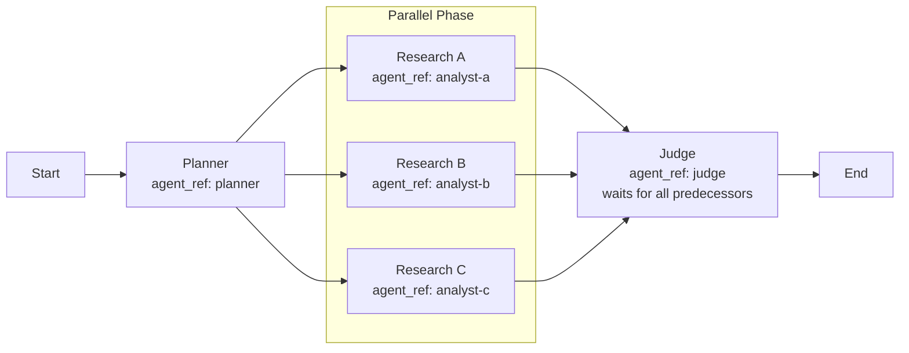

# ADR-0023: Graph Fan-out/Fan-in 기반 Parallel AgentNode Execution

- Status: Proposed
- Date: 2026-03-18
- Deciders: Product Owner, Builder

## Context

현재 Accepted ADR는 `Agent`와 `AgentNode`를 분리하고, 실행 구조의 책임을 `Skill` 그래프와 실행 정책에 둔다.
또한 최근 방향은 `AgentNode = agent_ref + action_text + done_criteria` 계약을 유지하면서 재사용 가능한 `Agent`를 plugin catalog에 두는 쪽으로 정리되고 있다.
병렬 실행을 도입할 때 `AgentNode` 안에 다른 `AgentNode`를 중첩하면 graph 모델, UI, 검증, 실행기 복잡도가 급격히 증가한다.
반대로 병렬성을 workflow edge 구조와 scheduler semantics로 표현하면 `Skill.md`의 설명, 캔버스 그래프, 런타임 해석을 같은 언어로 연결할 수 있다.
병렬 실행 표현 방식을 별도 ADR로 고정할 필요가 있다.

## Decision

병렬 실행은 `AgentNode` 내부 중첩이 아니라 workflow graph의 fan-out / fan-in 구조와 runtime scheduler로 표현한다.
`AgentNode`는 계속 평평한 graph node로 유지한다.
기본 join 정책은 `all predecessors complete`로 둔다.
병렬 branch 하나의 실패가 전체 병렬 phase를 즉시 실패시키지는 않는다.

핵심 결정 사항:

1. `Skill.workflow.nodes[*].type="Agent"` 노드는 계속 평평한 `AgentNode`로 유지한다.
2. `AgentNode`가 다른 `AgentNode` 또는 `Agent` 집합을 재귀적으로 포함하는 구조는 도입하지 않는다.
3. 병렬성은 한 노드에서 여러 후속 노드로 갈라지는 fan-out edge 구조로 표현한다.
4. 합류는 여러 선행 노드가 하나의 후속 노드로 모이는 fan-in edge 구조로 표현한다.
5. runtime은 같은 시점에 모든 선행 조건을 만족한 여러 `AgentNode`를 병렬 실행한다.
6. 기본 join 정책은 후속 노드의 모든 선행 노드가 완료되어야 실행 가능한 `all predecessors complete`로 고정한다.
7. branch 하나의 실패는 전체 병렬 phase를 즉시 실패시키지 않고, 다른 ready branch의 실행을 계속 허용한다.
8. join node는 성공/실패 여부를 포함한 branch 결과 집합을 구조화된 입력으로 받는다.
9. `Skill.md`는 병렬 단계의 목적과 join 규칙을 설명하는 문서층으로 사용한다.
10. 병렬 실행 가능 여부의 canonical 근거는 `Skill.md` 설명이 아니라 `SKILL.json.workflow`의 edge 구조다.
11. 병렬 실행 도입 후에도 `AgentNode` 계약은 `agent_ref + action_text + done_criteria`를 유지한다.

## Rationale

1. graph topology로 병렬성을 표현하면 저장 모델과 실행 모델이 가장 단순하게 정렬된다.
2. nested `AgentNode`를 피하면 UI와 validator가 재귀 구조를 다루지 않아도 된다.
3. `Skill.md` 설명과 workflow edge 구조가 직접 대응되어 사용자 이해가 쉬워진다.
4. reusable `Agent`와 병렬 실행 구조를 분리하면 재사용성과 실행 표현력을 동시에 확보할 수 있다.
5. fan-out / fan-in 모델은 planner -> parallel workers -> judge 패턴 같은 일반적인 multi-agent orchestration을 자연스럽게 표현한다.
6. branch failure를 non-fatal로 두면 병렬 분석/비교/집계 시나리오에서 부분 성공 결과를 최대한 활용할 수 있다.

## Consequences

긍정 효과:

1. 병렬 실행을 도입해도 `AgentNode` 모델과 Agent 카드 UX를 단순하게 유지할 수 있다.
2. runtime scheduler는 `ready set` 계산만으로 병렬 실행을 판단할 수 있다.
3. canvas는 중첩 카드 없이 edge 구조만으로 병렬 단계를 시각화할 수 있다.
4. join node가 실패 branch까지 인지하므로 후속 judge/aggregator agent가 부분 실패를 포함해 판단할 수 있다.

제약:

1. join 정책을 기본적으로 `all`로 고정하므로, `any`나 quorum 같은 고급 정책은 후속 ADR이 필요하다.
2. branch 결과의 표준 shape와 에러 surface 방식은 상세 계약이 더 필요하다.
3. 기존 순차 실행 중심 설명 문서와 테스트를 병렬 semantics에 맞게 확장해야 한다.

## Scope

포함:

1. graph fan-out / fan-in 기반 병렬 실행 표현 방식
2. `Skill.md`와 workflow graph의 역할 분리
3. runtime의 `ready set` 기반 병렬 스케줄링 규칙
4. branch failure non-fatal 원칙과 join input 기본 shape
5. nested `AgentNode` 비도입 원칙

제외:

1. `any` / quorum / weighted join 같은 고급 join 정책
2. retry / backoff / cancellation 상세 정책
3. 원격/분산 실행 환경
4. branch 결과의 상세 serialization schema

## Related Decisions

1. [ADR-0002-domain-model.md](/Users/zayden.ok/Desktop/dev-others/agent-work/docs/adr/ADR-0002-domain-model.md)
2. [ADR-0018-action-only-workflow-model.md](/Users/zayden.ok/Desktop/dev-others/agent-work/docs/adr/ADR-0018-action-only-workflow-model.md)
3. [ADR-0020-agentnode-composition-and-action-ownership.md](/Users/zayden.ok/Desktop/dev-others/agent-work/docs/adr/ADR-0020-agentnode-composition-and-action-ownership.md)
4. [ADR-0022-platform-neutral-assistant-package-canonical-and-agentnode-reference.md](/Users/zayden.ok/Desktop/dev-others/agent-work/docs/adr/ADR-0022-platform-neutral-assistant-package-canonical-and-agentnode-reference.md)
5. This ADR supersedes the `parallel execution is out of scope` interpretation in [ADR-0018-action-only-workflow-model.md](/Users/zayden.ok/Desktop/dev-others/agent-work/docs/adr/ADR-0018-action-only-workflow-model.md) only for workflow execution semantics. Action-only 모델 자체는 유지한다.

## Conclusion

병렬 실행은 `AgentNode`를 중첩하는 대신, `Skill` 그래프의 fan-out / fan-in 구조와 scheduler semantics로 표현하는 것이 가장 단순하고 일관적이다.
`Skill.md`는 병렬 단계의 목적과 join 규칙을 설명하고, runtime은 같은 시점에 `ready`가 된 여러 `AgentNode`를 동시에 실행한다.
branch 하나가 실패해도 전체 병렬 phase를 즉시 중단하지 않고, join node는 각 branch의 `status`와 결과를 함께 받아 후속 판단을 수행한다.

## Status Transition Notes

- Proposed -> Accepted 조건:
  1. 병렬 실행을 graph fan-out / fan-in으로 표현하는 데 합의
  2. nested `AgentNode`를 도입하지 않는 데 합의
  3. 기본 join 정책을 `all predecessors complete`로 두는 데 합의
  4. branch failure를 non-fatal로 두고 join node에 구조화된 결과를 넘기는 데 합의
  5. `AgentNode` 계약을 병렬 실행 도입 후에도 유지하는 데 합의
- Accepted -> Superseded 조건:
  1. 병렬 실행 표현을 nested subgraph 또는 다른 canonical 구조로 전환할 때
  2. join 정책 기본값 또는 스케줄링 의미가 재정의될 때
